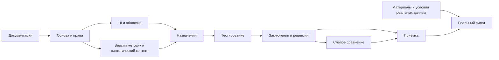

# Roadmap разработки

> Генерируется из `docs/roadmap.json`. Редактировать статусы и evidence в JSON, затем запускать `python3 scripts/build_spec.py`.

**Разработка начата.** Фактическая готовность определяется статусами и evidence ниже.

Календарные сроки не выдумываются: неизвестны доступность команды и готовность внешних материалов. Этапы определены зависимостями.

## Сводка

| Статус | Задач |
|---|---:|
| Не начато | 16 |
| В работе | 3 |
| Внешняя блокировка | 4 |
| На проверке | 1 |
| Готово | 43 |
| Отложено | 6 |

## Как работать

Берите незаблокированную задачу с завершёнными зависимостями. Укажите owner и `in_progress`. После проверки заполните evidence и только затем `done`. Внешние условия реального пилота не блокируют synthetic разработку.

## 0. Спецификация и передача

- [x] **D-01 · Определить продуктовый объём и три доступа** — Готово · P0
  - Зависимости: нет.
  - Спецификация: [00-scope.md](spec/00-scope.md), [01-product-roles.md](spec/01-product-roles.md).
  - Приёмка: Описаны режимы demo/research/validated_use, роли, состояния и границы P0.
  - Подтверждение: Документ подготовлен; приложение не реализовано. (`docs/spec/00-scope.md`)

- [x] **D-02 · Разобрать 15 референсов и задать дизайн-систему** — Готово · P0
  - Зависимости: D-01.
  - Спецификация: [02-design-system.md](spec/02-design-system.md), [README.md](references/README.md).
  - Приёмка: Все 15 референсов разобраны; Заданы токены, layout, states, accessibility и motion.
  - Подтверждение: Документ подготовлен; приложение не реализовано. (`docs/spec/02-design-system.md`)

- [x] **D-03 · Описать страницы и действия трёх доступов** — Готово · P0
  - Зависимости: D-01, D-02.
  - Спецификация: [03-manager-pages.md](spec/03-manager-pages.md), [04-employee-pages.md](spec/04-employee-pages.md), [05-admin-pages.md](spec/05-admin-pages.md).
  - Приёмка: Есть каталоги M01–M15, E01–E09, A01–A14.
  - Подтверждение: Документ подготовлен; приложение не реализовано. (`docs/spec/03-manager-pages.md`)

- [x] **D-04 · Задать архитектуру, БД, API и конвейер заключения** — Готово · P0
  - Зависимости: D-01.
  - Спецификация: [06-architecture.md](spec/06-architecture.md), [07-data-model.md](spec/07-data-model.md), [08-api-contracts.md](spec/08-api-contracts.md), [09-assessment-ai.md](spec/09-assessment-ai.md).
  - Приёмка: Зафиксированы стек, структура, сущности и серверные контракты.
  - Подтверждение: Документ подготовлен; приложение не реализовано. (`docs/spec/06-architecture.md`)

- [x] **D-05 · Описать безопасность, исследования и приёмку** — Готово · P0
  - Зависимости: D-04.
  - Спецификация: [10-security-privacy.md](spec/10-security-privacy.md), [11-experiments.md](spec/11-experiments.md), [12-quality-operations.md](spec/12-quality-operations.md).
  - Приёмка: Разделены прогноз/описание, задан blind workflow и privacy fence.
  - Подтверждение: Документ подготовлен; приложение не реализовано. (`docs/spec/10-security-privacy.md`)

- [x] **D-06 · Подготовить базу знаний и handoff** — Готово · P0
  - Зависимости: D-03, D-05.
  - Спецификация: [README.md](knowledge/README.md), [CLAUDE.md](../CLAUDE.md).
  - Приёмка: Есть ADR, вопросы, словарь, источники и правила команды.
  - Подтверждение: Документ подготовлен; приложение не реализовано. (`docs/knowledge/README.md`)

- [x] **D-07 · Собрать единый промпт, roadmap и проверить пакет** — Готово · P0
  - Зависимости: D-06.
  - Спецификация: [README.md](../README.md), [check_spec.py](../scripts/check_spec.py).
  - Приёмка: Все внутренние ссылки существуют; Dependency graph без циклов; Полнота страниц проверена; Сводный prompt актуален.
  - Подтверждение: Пакет собран. Проверены внутренние ссылки, DAG задач, все 38 страниц/групп состояний и актуальность сводного документа; ошибок нет. Проверка относится только к документации. (`docs/verification.json`)
  - Проверка: `python3 scripts/build_spec.py && python3 scripts/check_spec.py`.

## 1. Основа приложения и границы доступа

- [x] **F-01 · Создать npm monorepo и закрепить совместимые версии** — Готово · P0
  - Зависимости: D-07.
  - Спецификация: [06-architecture.md](spec/06-architecture.md).
  - Приёмка: Node/npm pinned, один lockfile; web/api/worker/evaluator workspaces; npm ci/build/typecheck работают на чистом окружении.
  - Подтверждение: На чистом окружении (node_modules удалены) установка из lockfile, сборка всех 11 workspaces, typecheck и lint проходят без ошибок. Node 24.21.0 LTS и npm 11.19.0 закреплены в engines/.nvmrc/packageManager.
  - Проверка: `npm ci && npm run build && npm run typecheck && npm run lint`.
  - Подтверждение: npm workspaces: apps/web|api|worker|evaluator и packages/config|contracts|domain|database|scoring|ai|testing. Один package-lock.json. Точные версии без диапазонов. allowScripts ограничивает install-скрипты пятью проверенными пакетами. (`package.json`)

- [x] **F-02 · Поднять PostgreSQL, schema, миграции и runtime roles** — Готово · P0
  - Зависимости: F-01.
  - Спецификация: [07-data-model.md](spec/07-data-model.md).
  - Приёмка: Migration owner отделён от runtime; Tenant tables/composite FK/RLS созданы; Две synthetic компании изолированы.
  - Подтверждение: 9 SQL-миграций применены на PostgreSQL 18.6. 13 integration-тестов проходят под runtime-ролями: изоляция организаций, отказ без контекста, отказ записи чужого organization_id, отсутствие доступа worker к identity и evaluation, отсутствие доступа api к evaluation, отсутствие BYPASSRLS.
  - Проверка: `npm run db:migrate && npm run test:integration`.
  - Подтверждение: RLS + FORCE ROW LEVEL SECURITY на 26 строгих tenant-таблицах и 6 таблицах метаданных. Роли context_api/context_worker/context_evaluator без BYPASSRLS и без прав на DDL. (`packages/database/migrations/0008_rls_and_grants.sql`)

- [x] **F-03 · Создать контракты API, error model и typed client** — Готово · P0
  - Зависимости: F-01.
  - Спецификация: [08-api-contracts.md](spec/08-api-contracts.md).
  - Приёмка: Zod server/client shared public DTO; OpenAPI генерируется; Problem JSON и requestId работают; Ключи scoring не входят в browser bundle.
  - Подтверждение: Общие Zod-схемы DTO: ошибки (problem+json с кодом и requestId), пагинация с allowlist сортировки, auth, методики, сценарии, сотрудники, организации. Сервер валидирует теми же схемами, которые экспортируются для web. (`packages/contracts/src`)
  - Подтверждение: Ответ application/problem+json: 403 FORBIDDEN с requestId. Неизвестный маршрут — 404 NOT_FOUND в том же формате. Ключи подсчёта живут в отдельном серверном пакете @context/scoring, который web не импортирует.
  - Проверка: `curl -X POST /api/v1/anything (без CSRF)`.

- [x] **F-04 · Реализовать manager/admin auth, активацию и восстановление** — Готово · P0
  - Зависимости: F-02, F-03.
  - Спецификация: [10-security-privacy.md](spec/10-security-privacy.md), [03-manager-pages.md](spec/03-manager-pages.md).
  - Приёмка: Opaque sessions/Argon2id/CSRF/rate limit; Активация/ручное восстановление без token leak; Logout/password reset revoke sessions.
  - Подтверждение: Вход руководителя выдаёт HttpOnly-cookie и профиль с membership. Неверный пароль и несуществующий адрес дают одинаковый ответ 401 «Неверный адрес электронной почты или пароль». Реализованы activate, password-reset, recovery-requests с единым ответом, смена пароля с отзывом прочих сессий, список и отзыв своих сессий.
  - Проверка: `curl POST /api/v1/auth/login`.
  - Подтверждение: Argon2id (memoryCost 19456, timeCost 2), opaque-сессии с HMAC-хэшем в БД, проверка пароля выполняется и для несуществующего аккаунта. Токены активации и сброса одноразовые, в открытом виде не хранятся. (`apps/api/src/modules/auth/auth.service.ts`)

- [x] **F-05 · Реализовать memberships, permissions, tenant guards** — Готово · P0
  - Зависимости: F-04.
  - Спецификация: [01-product-roles.md](spec/01-product-roles.md), [06-architecture.md](spec/06-architecture.md).
  - Приёмка: Каждый tenant запрос scoped; Чужой ID не раскрывается; Последний owner защищён; Tenant context не протекает через pool.
  - Подтверждение: Каждый tenant-запрос проходит ManagerGuard: организация берётся из подтверждённого membership, а не из тела запроса. Чужой orgId и чужой employeeId дают одинаковый 404. Разрешения проверяются декоратором RequirePermissions на каждом маршруте. (`apps/api/src/platform/auth/guards/manager.guard.ts`)
  - Подтверждение: 404 NOT_FOUND без раскрытия существования. Последний владелец организации защищён: снятие org.manage и отзыв членства у единственного владельца отвечают 409. Контекст организации transaction-local и не протекает через пул (проверено integration-тестом).
  - Проверка: `curl /api/v1/orgs/<чужой-id>/employees`.

- [x] **F-06 · Добавить outbox, pg-boss, retry и idempotency** — Готово · P0
  - Зависимости: F-02, F-03.
  - Спецификация: [06-architecture.md](spec/06-architecture.md), [08-api-contracts.md](spec/08-api-contracts.md).
  - Приёмка: Submit+outbox atomic; Повторное событие не создаёт повторный эффект; Технический payload не содержит PII/labels.
  - Подтверждение: Событие пишется в той же транзакции, что и бизнес-изменение: отправка теста и постановка задачи на подсчёт атомарны. Диспетчер в worker читает outbox через for update skip locked и доставляет в pg-boss. Схему очереди создаёт владелец при миграции — worker подключается с migrate:false и не имеет прав DDL. (`apps/api/src/platform/outbox/outbox.service.ts`)
  - Подтверждение: Повторная доставка события не создаёт второй результат: score_results уникальны по (attempt, scorer_version, input_hash), заключение создаётся один раз при наличии reports. Payload очереди содержит только идентификаторы и поколение данных, без ответов и персональных сведений.
  - Проверка: `npm run db:migrate + запуск worker`.

- [x] **F-07 · Подготовить synthetic factories, seeds и test environment** — Готово · P0
  - Зависимости: F-02, F-05.
  - Спецификация: [12-quality-operations.md](spec/12-quality-operations.md).
  - Приёмка: Две компании/роли/разные состояния; Seed отказывается работать в production; Никаких реальных людей и copyrighted tests.
  - Подтверждение: Две изолированные организации, 4 учётные записи (админ, два руководителя, рецензент), 13 вымышленных сотрудников, 3 синтетические методики и 3 сценария. Пароли генерируются при каждом запуске и не хранятся в коде. Seed отказывается работать при APP_ENV=production|staging.
  - Проверка: `npm run db:seed:demo`.
  - Подтверждение: Все имена, коды и адреса вымышлены (домен .invalid). Реальных людей, чужих методик и данных со скриншотов референсов нет. (`packages/testing/src/synthetic-people.ts`)

## 2. Дизайн-система и оболочки

- [x] **U-01 · Реализовать tokens, typography и UI primitives** — Готово · P0
  - Зависимости: F-01, D-02.
  - Спецификация: [02-design-system.md](spec/02-design-system.md).
  - Приёмка: Warm palette/self-hosted Cyrillic font; Button/fields/dialog/drawer/status/skeleton/toast; Контраст и keyboard проверены.
  - Подтверждение: Тёплая светлая палитра из раздела 02.2, семантические токены, радиусы 12/24/32, шаг пространства 4–64, мягкие тени. Manrope с кириллицей самохостится через next/font (внешних запросов к CDN в рантайме нет). Реализованы prefers-reduced-motion и prefers-contrast. (`apps/web/src/styles/tokens.css`)
  - Подтверждение: Button (loading без изменения ширины, disabled с причиной рядом), Field с inline-ошибкой и счётчиком символов, Badge (цвет не единственный носитель смысла), DataTable с карточной раскладкой до 768px, ConfirmDialog с безопасным фокусом на «Отмена», DetailDrawer, Toast, Skeleton, EmptyState, ErrorState, ForbiddenState, StepProgress, StageIndicator. (`apps/web/src/components/ui`)

- [x] **U-02 · Собрать три адаптивные оболочки** — Готово · P0
  - Зависимости: U-01, F-05.
  - Спецификация: [02-design-system.md](spec/02-design-system.md), [01-product-roles.md](spec/01-product-roles.md).
  - Приёмка: Manager/admin/participant отличаются навигацией; Route protection server-side; 360–1440px, 200% zoom, no overflow.
  - Подтверждение: Три разные оболочки: кабинет руководителя с боковой навигацией, участие без корпоративной навигации и списков людей, публичный вход. Пункты меню строятся по фактическим разрешениям: рецензент видит «Проверка заключений» и не видит «Настройки». Разделы без реализации из меню убраны, а не заглушены.
  - Проверка: `скриншоты /login, /app, /participate в браузере`.
  - Подтверждение: Проверены 375px и ~800px: боковая навигация уходит в выдвижное меню, таблицы становятся карточками, нижние действия учитывают safe-area-inset-bottom, элементы выбора не ниже 44px.
  - Проверка: `эмуляция 375x812 в браузере`.

- [x] **U-03 · Сделать общие таблицы, формы и states** — Готово · P0
  - Зависимости: U-01, F-03.
  - Спецификация: [02-design-system.md](spec/02-design-system.md).
  - Приёмка: Pagination/filter URL/row menu; Inline validation + реальные toasts; Loading/empty/error/conflict/reduced motion.
  - Подтверждение: Пагинация с видимым общим количеством, фильтры в URL, состояния loading/empty/filter-empty/error у списков. Toast показывается только после подтверждения сервером. (`apps/web/src/components/ui/table.tsx`)

- [ ] **U-04 · Десктопное продолжение редизайна: календарь, списки, конструктор и опрос** — На проверке · P0
  - Зависимости: нет.
  - Спецификация: [02-design-system.md](spec/02-design-system.md), [04-employee-pages.md](spec/04-employee-pages.md).
  - Приёмка: Общие компоненты обновлены и проверены; Закрытые сценарии проходят визуальную приёмку после входа; Мобильная версия отложена до указания пользователя.
  - Подтверждение: Описание изменений, файлов, проверок и оставшихся ограничений; 76 unit-тестов, web typecheck и ESLint проходят. (`docs/knowledge/UI_UX_REVIEW.md`)
  - Подтверждение: Диапазон и фокус календаря проверены в браузере. (`apps/web/src/components/ui/date-field.tsx`)
  - Подтверждение: Серверный поиск и пагинация интегрированы в фильтр и мастер назначения. (`apps/web/src/components/employees/employee-picker.tsx`)
  - Подтверждение: Три регрессионных теста очереди проходят. (`apps/web/src/lib/answer-save-queue.test.ts`)
  - Подтверждение: Общий просмотр источников проверен в браузере; заключение и рецензия обновлены. 78 unit-тестов, web typecheck и ESLint проходят. Закрытые страницы ожидают входа. (`apps/web/src/components/reports/evidence-browser.tsx`)

## 3. Сценарии руководителя и назначение

- [x] **M-01 · Организация, доступы и настройки руководителя M13** — Готово · P0
  - Зависимости: F-05, U-02, U-03.
  - Спецификация: [03-manager-pages.md](spec/03-manager-pages.md).
  - Приёмка: Настройки организации и контакт для участника сохраняются; Список доступов с разрешениями и панель готовности видны владельцу; Последний владелец защищён, отзыв членства закрывает сессии.
  - Подтверждение: Настройки организации и контакт для участника сохраняются и видны участнику. Список доступов показывает разрешения каждого руководителя. Панель готовности перечисляет незакрытые пункты и блокирует реальные оценки.
  - Проверка: `скриншот /app/settings + curl PATCH /orgs/<id>`.
  - Подтверждение: 409 с объяснением: последнего владельца снять нельзя. Отзыв членства закрывает активные сессии пользователя.
  - Проверка: `curl DELETE /orgs/<id>/members/<последний владелец>`.

- [x] **M-02 · Сотрудники M03/M04** — Готово · P0
  - Зависимости: M-01.
  - Спецификация: [03-manager-pages.md](spec/03-manager-pages.md).
  - Приёмка: Create/edit/list/search/archive; Employee detail/tabs; Tenant-safe operations и batch results.
  - Подтверждение: Список с поиском по имени и коду, фильтром состояния, пагинацией и пустыми состояниями. Добавление через боковую панель: обязательно имя или внутренний код, дубль кода отвергается сообщением у поля. Архивирование требует явного решения по активным оценкам, тихой отмены нет.
  - Проверка: `скриншот /app/employees + curl API`.
  - Подтверждение: Карточка сотрудника с вкладками «Оценки», «Заключения» и «История действий». В шапке нет ни балла, ни процента, ни уровня: постоянного профиля человека платформа не ведёт. Архивирование требует явного решения по активным оценкам.
  - Проверка: `скриншот /app/employees/<id>`.

- [x] **M-03 · Scenario catalog и серверные draft назначения** — Готово · P0
  - Зависимости: F-03, F-05, R-01.
  - Спецификация: [03-manager-pages.md](spec/03-manager-pages.md), [08-api-contracts.md](spec/08-api-contracts.md).
  - Приёмка: Три сценария с pinned versions; Context schema валидируется; Draft revision сохраняется.
  - Подтверждение: Три сценария с закреплёнными версиями методик и схемой контекста. Ключи подсчёта, баллы вариантов и шкалы в ответе отсутствуют. Доступность назначения считается по режиму организации и готовности: сценарий demo-уровня не назначается в реальном режиме.
  - Проверка: `curl /api/v1/orgs/<id>/scenarios`.

- [x] **M-04 · Wizard назначения M05** — Готово · P0
  - Зависимости: M-02, M-03, U-03.
  - Спецификация: [03-manager-pages.md](spec/03-manager-pages.md).
  - Приёмка: Четыре шага и preview; 1–50 участников, individual context; Duplicate policy, draft restore, real mode gate.
  - Подтверждение: Четыре шага: вопрос с видимыми ограничениями сценария, контекст по схеме с серверной валидацией, выбор сотрудников и срока, проверка перед созданием. Создание атомарно: при недопустимом элементе не создаётся ни одного назначения.
  - Проверка: `скриншот /app/assessments/new + curl POST assignments/batch`.

- [x] **M-05 · Invitations: issue/rotate/revoke/deadline** — Готово · P0
  - Зависимости: M-04, F-06.
  - Спецификация: [10-security-privacy.md](spec/10-security-privacy.md), [08-api-contracts.md](spec/08-api-contracts.md).
  - Приёмка: Random token hash, URL fragment; Once-only delivery и понятный повтор после timeout; Rotation revokes old sessions.
  - Подтверждение: Токен 32 случайных байта, в БД только HMAC-SHA-256. Открытая ссылка возвращается один раз; в журнале приложения токена нет (проверено grep). Повторный выпуск отзывает прежнюю ссылку и открытые сессии участника.
  - Проверка: `curl POST assignments/<id>/invitations + grep по журналу`.

- [x] **M-06 · Список/детали назначения M06/M07** — Готово · P0
  - Зависимости: M-05.
  - Спецификация: [03-manager-pages.md](spec/03-manager-pages.md).
  - Приёмка: Все статусы реальны; Cancel/deadline transitions и race handling; Raw answers не выдаются manager.
  - Подтверждение: Список с фильтрами по состоянию и вопросу, детали с контекстом, состоянием методик, историей и допустимыми действиями. Ответы участника руководителю не показываются. Отмена спрашивает причину и перечисляет последствия.
  - Проверка: `скриншоты /app/assessments и /app/assessments/<id>`.

- [x] **M-07 · Dashboard и notifications M02/M14** — Готово · P0
  - Зависимости: M-06, F-06.
  - Спецификация: [03-manager-pages.md](spec/03-manager-pages.md).
  - Приёмка: Реальные counts/attention items; Фильтры карточек согласованы со списком; Notification recipient scope и dedup.
  - Подтверждение: Четыре карточки с реальными количествами из тех же выборок, что и списки; блок «Требуют внимания» с истекающими ссылками и готовыми заключениями; последние оценки. Пустое состояние предлагает конкретный следующий шаг.
  - Проверка: `скриншот /app`.

## 4. Прохождение сотрудником

- [x] **E-01 · Вход по ссылке и participant session E01** — Готово · P0
  - Зависимости: M-05, U-02.
  - Спецификация: [04-employee-pages.md](spec/04-employee-pages.md), [10-security-privacy.md](spec/10-security-privacy.md).
  - Приёмка: GET не потребляет token; POST exchange очищает fragment; Invalid/revoked/expired и session lease.
  - Подтверждение: Токен приходит во fragment и не попадает в журнал сервера и Referer. Открытие ссылки ничего не активирует: обмен только по нажатию кнопки, поэтому предпросмотр ссылки почтовым сканером не расходует приглашение. После обмена секрет убирается из адресной строки через history.replaceState. Недействительный, отозванный и истёкший токен дают один ответ.
  - Проверка: `скриншот /participate + curl POST /participant/exchange`.

- [x] **E-02 · Информирование, consent и отказ E02/E08** — Готово · P0
  - Зависимости: E-01, R-01.
  - Спецификация: [04-employee-pages.md](spec/04-employee-pages.md), [10-security-privacy.md](spec/10-security-privacy.md).
  - Приёмка: Version/hash/purpose сохранены; Checkbox не предвыбран; Отказ нейтрален, draft documents не допускают real launch.
  - Подтверждение: Версия и хэш документа сохраняются вместе с согласием. Флажок не предвыбран, кнопка «Согласен» недоступна до подтверждения и показывает причину. Образец документа помечен предупреждением; сервер отказывает в согласии на неутверждённый документ вне demo-режима. Отказ фиксируется нейтрально.
  - Проверка: `скриншот /participant/welcome`.
  - Подтверждение: 403 FORBIDDEN «Сначала прочитайте условия участия и подтвердите согласие»: доступ к вопросам закрыт до согласия на уровне сервера.
  - Проверка: `curl GET /participant/attempts до согласия`.

- [x] **E-03 · Список методик и инструкции E03/E04** — Готово · P0
  - Зависимости: E-02.
  - Спецификация: [04-employee-pages.md](spec/04-employee-pages.md).
  - Приёмка: Pinned order/version; Start/continue states; Нет ключей/выдуманного времени.
  - Подтверждение: Порядок методик задан версией сценария. Показаны число вопросов, ограничения методики и «время прохождения пока не измерено» вместо выдуманной оценки. Баллов, рейтингов и чужих результатов нет.
  - Проверка: `скриншот /participant`.

- [x] **E-04 · Renderer всех типов вопросов E05** — Готово · P0
  - Зависимости: E-03, U-03.
  - Спецификация: [04-employee-pages.md](spec/04-employee-pages.md).
  - Приёмка: single/multiple/likert/numeric/text/situational; Keyboard/mobile доступность; Required и bounds from schema.
  - Подтверждение: Реализованы single_choice, multiple_choice, likert, numeric, short_text и situational. Шкала — группа радиокнопок с подписями, а не только ползунок. Автоперехода при выборе нет, области нажатия не ниже 44px, фокус переводится на заголовок вопроса при смене шага. (`apps/web/src/app/(participant)/participant/tests/[attemptId]/_components/question-renderer.tsx`)
  - Подтверждение: Сервер проверяет ответ по закреплённой версии методики: чужой вариант, значение вне шкалы и превышение лимита выбора отвергаются с ошибкой у поля.
  - Проверка: `curl PUT answers с вариантом из другой версии`.

- [x] **E-05 · Autosave, revision, lease и восстановление** — Готово · P0
  - Зависимости: E-04, F-06.
  - Спецификация: [04-employee-pages.md](spec/04-employee-pages.md), [08-api-contracts.md](spec/08-api-contracts.md).
  - Приёмка: Network outage/refresh/second tab; Переход ждёт сохранения; No silent overwrite/local PII persistence.
  - Подтверждение: 409 REVISION_CONFLICT «Тест открыт в другом окне»: тихой перезаписи из второй вкладки нет. Переход к следующему вопросу ждёт подтверждения сохранения; несохранённое не выдаётся за сохранённое. Ответы не пишутся в localStorage.
  - Проверка: `participant_run.py: сохранение с устаревшей ревизией`.

- [x] **E-06 · Submit/review/completion E06/E07/E09** — Готово · P0
  - Зависимости: E-05.
  - Спецификация: [04-employee-pages.md](spec/04-employee-pages.md).
  - Приёмка: Atomic snapshot+outbox; Submit idempotent; Submitted immutable, all exceptional states.
  - Подтверждение: Повторная отправка возвращает тот же факт отправки, в том числе для последнего теста (идемпотентна). Правка после отправки — 409 STATE_CONFLICT. Отправка атомарна: снимок ответов, смена состояния и событие обработки в одной транзакции. Неполные обязательные ответы отвергаются с перечнем.
  - Проверка: `participant_run.py: повторная отправка и правка после отправки`.

## 5. Методики, заключения и администрирование

- [x] **R-01 · Методики/scenarios persistence и synthetic bundle** — Готово · P0
  - Зависимости: F-02, F-03, F-07.
  - Спецификация: [09-assessment-ai.md](spec/09-assessment-ai.md), [07-data-model.md](spec/07-data-model.md).
  - Приёмка: Три явно synthetic методики/сценария; Versioning/immutable published/hash; Mode applicability policy.
  - Подтверждение: Три методики явно помечены синтетическими: в паспорте зафиксировано отсутствие норм, проверенной связи с рабочими результатами и права называться измерением. applicability_mode=demo. Опубликованные версии неизменяемы (триггер forbid_published_content_update), содержимое хэшируется SHA-256. (`packages/testing/src/synthetic-methods.ts`)
  - Подтверждение: Каталог отдаёт три сценария с закреплёнными версиями методик, схемой контекста и ограничениями. Ключи подсчёта, баллы вариантов и шкалы в ответе отсутствуют (проверено grep по ответу).
  - Проверка: `curl /api/v1/orgs/<id>/scenarios`.

- [x] **R-02 · Просмотр методик, контрольные примеры и публикация A04/A05** — Готово · P0
  - Зависимости: R-01, U-02, U-03.
  - Спецификация: [05-admin-pages.md](spec/05-admin-pages.md).
  - Приёмка: Список методик с версиями, статусом и отдельным признаком проверенности применимости; Паспорт версии: назначение, ограничения, права, вопросы и ключи подсчёта; Прогон контрольных примеров и переходы состояний с проверкой перед публикацией.
  - Подтверждение: Паспорт версии с назначением, целевой группой, источником, основанием использования и ограничениями. Вопросы и ключи подсчёта видны только здесь. Прогон контрольных примеров сравнивает ожидаемые и фактические значения шкал по каждому примеру.
  - Проверка: `скриншот /admin/methods/<versionId> + POST check`.
  - Подтверждение: Переходы состояний проверяются конечным автоматом. Публикация отвергается без контрольных примеров, без ограничений применения, без основания использования и при ссылке шкалы на несуществующий вопрос. Признак «применимость проверена» отделён от факта публикации. (`apps/api/src/modules/admin/admin-content.service.ts`)

- [x] **R-03 · Просмотр сценариев, состава методик и правил заключения A06** — Готово · P0
  - Зависимости: R-02.
  - Спецификация: [05-admin-pages.md](spec/05-admin-pages.md).
  - Приёмка: Список сценариев с версиями и составом; Схема контекста с ролью каждого поля и правила заключения; Публикация проверяет опубликованность и уровень готовности вложенных методик.
  - Подтверждение: Состав методик с порядком и обязательностью, схема контекста с ролью каждого поля (параметр решения, рабочий факт, мнение руководителя), правила заключения с допустимыми, обязательными и запрещёнными утверждениями.
  - Проверка: `скриншот /admin/scenarios/<versionId>`.
  - Подтверждение: Публикация сценария отвергается, если нет методик, нет политики отчёта, методика не опубликована или её уровень готовности ниже уровня сценария. (`apps/api/src/modules/admin/admin-content.service.ts`)

- [x] **R-04 · Детерминированный scoring engine** — Готово · P0
  - Зависимости: R-01, F-06.
  - Спецификация: [09-assessment-ai.md](spec/09-assessment-ai.md).
  - Приёмка: Allowlisted operators/missing policy; Boundary fixtures проверены; Scorer version/input hash сохранены.
  - Подтверждение: 24 unit-теста проходят. Проверены: обратный подсчёт min+max-ответ, пропуск при mark_unknown даёт null а не ноль, политика reject отвергает неполные данные, exclude_item считает по имеющимся, значение вне шкалы и вариант из другой версии отвергаются, свободный текст не может входить в шкалу, одинаковый вход даёт одинаковый хэш.
  - Проверка: `npm run test`.
  - Подтверждение: Операторы sum/mean/weighted_sum из allowlist. Декларативная конфигурация не исполняет код. Результат помечен scorerVersion и input hash. (`packages/scoring/src/engine.ts`)

- [x] **R-05 · Evidence builder и report schema** — Готово · P0
  - Зависимости: R-04, E-06.
  - Спецификация: [09-assessment-ai.md](spec/09-assessment-ai.md).
  - Приёмка: Источники разделены по типу; Минимальный payload без identity/labels; Unknown не превращается в отрицательное качество.
  - Подтверждение: Свидетельства разделены по типу: work_fact только для поля наблюдаемых фактов, manager_opinion для мнения руководителя, self_report для ответов участника, method_result для шкал. Параметры задачи (вопрос, роль, срок) свидетельством не становятся — у поля контекста есть явная роль evidenceRole.
  - Проверка: `python3 e2e.py + SQL по core.evidence_items`.
  - Подтверждение: Неопределённая шкала отражается как отсутствие сведений с пояснением, а не как низкий балл. Payload провайдера использует код случая вместо имени; роль worker вообще не имеет доступа к схеме identity. (`apps/worker/src/jobs/evidence.ts`)

- [x] **R-06 · Fake/template providers и generation worker** — Готово · P0
  - Зависимости: R-05.
  - Спецификация: [09-assessment-ai.md](spec/09-assessment-ai.md).
  - Приёмка: Schema/evidence validation; Timeout/retry/generation fence; Fake никогда не подменяет real output.
  - Подтверждение: Проверка выхода блокирует публикацию при: несуществующем evidence ID, отсутствии обязательного ограничения, запрещённом политикой утверждении, проценте или вероятности в тексте, прогнозе без зарегистрированной возможности. Несоответствие создаёт ревизию generation_failed, а не правит смысл молча. (`packages/ai/src/validate.ts`)
  - Подтверждение: Провайдер вызывается вне транзакции БД, с таймаутом и AbortSignal. Перед записью повторно проверяются поколение данных, processing_hold и состояние назначения. FakeProvider допустим только в demo-режиме (assertProviderAllowedInMode) и не подменяет реальный результат при сбое.
  - Проверка: `запуск worker на синтетическом назначении`.

- [x] **R-07 · Scoped grants и review/publish A08/M15** — Готово · P0
  - Зависимости: R-06, M-01.
  - Спецификация: [05-admin-pages.md](spec/05-admin-pages.md), [01-product-roles.md](spec/01-product-roles.md).
  - Приёмка: Org owner approve + TTL; Checklist/revision/publish immutable; No outcome access для reviewer.
  - Подтверждение: Руководитель без reports.review получает 403 и не видит очередь проверки. Рецензент видит черновик по коду случая без имени сотрудника, вместе с источниками и их ограничениями. Публикация с неполным чек-листом отвергается; опубликованная ревизия хранит идентификатор рецензента, дату и hash содержимого.
  - Проверка: `review.py`.

- [x] **R-08 · Список/просмотр/печать отчёта M08/M09** — Готово · P0
  - Зависимости: R-07, U-03.
  - Спецификация: [03-manager-pages.md](spec/03-manager-pages.md).
  - Приёмка: Conclusion/evidence/limits/actions; Только published projection; Print layout и superseded handling.
  - Подтверждение: Порядок: вывод, что это означает для решения, основания с источниками, противоречия, ограничения, следующие шаги, что может изменить вывод, сведения о подготовке. Ограничения показаны наравне с выводом, а не мелким шрифтом. Непубликованная ревизия недоступна даже по прямой ссылке. Есть печатная версия без навигации.
  - Проверка: `скриншот /app/reports/<id>`.

- [x] **R-09 · Управленческие записи и correction workflow** — Готово · P0
  - Зависимости: R-08.
  - Спецификация: [03-manager-pages.md](spec/03-manager-pages.md).
  - Приёмка: Decision не меняет report и не становится outcome; Correction receipt/review/revision; Нет автоматических кадровых действий.
  - Подтверждение: Управленческая запись сохраняется отдельно и не меняет текст заключения (проверено сравнением summary до и после). Варианты действий нейтральны, автоматических кадровых действий нет. Реализован запрос на исправление: отчёт остаётся доступным с отметкой запроса.
  - Проверка: `review.py шаг 8`.

- [ ] **R-10 · Экран AI prompts/provider status A07** — Не начато · P0
  - Зависимости: R-06, U-02.
  - Спецификация: [05-admin-pages.md](spec/05-admin-pages.md).
  - Приёмка: Versioned prompts/synthetic tests; Secrets не отдаются UI; Provider policy gate.

- [x] **R-11 · Технические jobs/audit/admin dashboard A01/A09/A11** — Готово · P0
  - Зависимости: R-07, M-07.
  - Спецификация: [05-admin-pages.md](spec/05-admin-pages.md), [10-security-privacy.md](spec/10-security-privacy.md).
  - Приёмка: Очередь обработки с фильтрами по типу, состоянию, периоду и организации; Строка без полезной нагрузки: код организации, код случая, попытки, измеренная задержка, код ошибки; Повтор проверяет состояние назначения, согласие и ограду поколения данных; повторы можно остановить; Журнал аудита с фильтрами, аудитом самих обращений и allowlist метаданных в развёрнутой записи.
  - Подтверждение: 64 integration-теста на реальной БД, из них 17 — на экране обработки и журнале. Закреплено: состояние задания выводится из отметок, фильтр по состоянию не выдаёт лишнего, детали не содержат значений полезной нагрузки, обращение к деталям пишется в аудит, повторяемая ошибка возвращает задание в очередь, постоянная ошибка содержимого и успешное задание повтору не подлежат, лимит повторов останавливает попытки, повтор запрещён при смене поколения данных, отозванном согласии и отменённом назначении, остановка убирает строку из выборки диспетчера, сводка считает упавшие задания по факту, скрытые поля метаданных показываются именем.
  - Проверка: `npm run test:integration`.
  - Подтверждение: Фильтры по типу события, состоянию, периоду и организации; строки с кодом случая и измеренной задержкой; техническая карточка без значений полезной нагрузки; кнопка повтора отключена с названной причиной; остановка и возобновление повторов меняют состояние; вкладка аудита показывает job.details_read, job.retries_stopped и job.retries_resumed с раскрытием записи.
  - Проверка: `проход по /admin/operations в браузере`.
  - Подтверждение: Исход задания, время завершения и остановка повторов появились в строке outbox. До этого обработчик нигде не фиксировал результат, и счётчик ошибок на экране администратора всегда показывал ноль независимо от положения дел. (`packages/database/migrations/0011_job_outcomes.sql`)
  - Подтверждение: Узкий SECURITY DEFINER резолвер условий повтора. Состояние назначения и согласие закрыты строгой tenant-политикой, в которую эксплуатационный режим администратора не входит; резолвер возвращает только признаки состояния, без ответов и контекста решения. (`packages/database/migrations/0012_job_retry_guard.sql`)

- [ ] **R-16 · Временный доступ к данным организации и его аудит M13/A03** — В работе · P0
  - Зависимости: R-11, R-13.
  - Спецификация: [05-admin-pages.md](spec/05-admin-pages.md), [10-security-privacy.md](spec/10-security-privacy.md).
  - Приёмка: Запрос временного доступа указывает причину, объём, назначение и срок; Выдаёт уполномоченный владелец организации, не сам запрашивающий; срок ограничен; Отзыв и истечение закрывают доступ немедленно; Выдача, продление и отзыв видны в журнале аудита; UI ещё не реализовано (запрет на apps/web в этом запуске): раздел «Доступы» в /app/settings и /admin/organizations/[orgId] — без интерфейса функцию не может использовать ни администратор, ни владелец организации, только прямые HTTP-запросы.
  - Подтверждение: Два SECURITY DEFINER-резолвера для составления объёма гранта администратором: app.resolve_org_assignment_index (assignment_id, scenario_title, scenario_code, created_at — без имени сотрудника, состояния назначения и признаков заключения) и app.resolve_org_assignment_ids (только проверка существования id). Оба требуют app.is_platform_ops() и выданы execute только context_api; core.answers/evidence_items/reports в этой транзакции не открываются. (`packages/database/migrations/0016_admin_assignment_index.sql`)
  - Подтверждение: 6 файлов, 100 integration-тестов (было 95), все прошли под runtime-ролями. Закреплено: self-approval запрещён (запрашивающий не может сам себе одобрить), объём — только конкретные назначения (blanket-доступ невозможен), срок ограничен CHECK access_grants_max_duration и считается часами БД, истечение и оба вида отзыва (владельцем и самим запросившим) закрывают доступ немедленно, продление — новой записью с сохранением исходного срока, выдача/продление/отзыв/успешное чтение по гранту (cases_listed) и отказы (unknown_grant/not_owner/org_mismatch) пишутся в аудит, кросс-tenant перечень назначений закрыт AdminGuard и работает только в platformOps-транзакции (0 строк в обычной tenant-транзакции).
  - Проверка: `npm run test:integration`.
  - Подтверждение: GET .../admin/organizations/:orgId/assignments отдаёт ровно поля [assignmentId, caseCode, scenarioTitle, scenarioCode, createdAt] без имён и GRANT-кодов; approve с useRequestedHours=true выдаёт ровно запрошенный срок; самоотзыв нерешённого обращения делает последующий approve владельцем невозможным (409).
  - Проверка: `HTTP-смоук на dev-API синтетическими учётками`.

- [ ] **R-12 · База знаний в приложении M12/A10** — Не начато · P0
  - Зависимости: U-02, F-03, F-05.
  - Спецификация: [03-manager-pages.md](spec/03-manager-pages.md), [05-admin-pages.md](spec/05-admin-pages.md).
  - Приёмка: Audience/version/search; Sanitized Markdown; Начальные полезные статьи без ключей/PII.

- [x] **R-13 · Кабинет администратора: организации и готовность A02/A03** — Готово · P0
  - Зависимости: M-01, U-02.
  - Спецификация: [05-admin-pages.md](spec/05-admin-pages.md).
  - Приёмка: Создание организации, приостановка и возобновление; Приглашение владельца и очередь запросов восстановления; Изменение пунктов готовности с автором и подтверждением.
  - Подтверждение: Создание организации вместе с владельцем: новая организация начинает в demo-режиме, все 11 пунктов готовности открыты, реальные оценки заблокированы. Ссылка активации владельца показывается один раз. Приостановка и возобновление работают, диалог перечисляет последствия.
  - Проверка: `скриншоты /admin/organizations и /admin/organizations/<id>`.
  - Подтверждение: 403 «Этот раздел доступен только администратору платформы»; без сессии — 401. Администратору видны только количества: список сотрудников и содержание оценок закрыты строгой политикой RLS.
  - Проверка: `curl /api/v1/admin/organizations под сессией руководителя`.

- [x] **R-14 · Редактор содержимого методики A05** — Готово · P0
  - Зависимости: R-02.
  - Спецификация: [05-admin-pages.md](spec/05-admin-pages.md).
  - Приёмка: Создание новой версии методики и правка черновика; Редактор вопросов со стабильными идентификаторами и порядком; Редактор ключей подсчёта из allowlist без исполняемого кода; Импорт версионированного JSON с предпросмотром ошибок до записи.
  - Подтверждение: 48 модульных и 35 integration-тестов проходят. Закреплено: пустой черновик читается и перечисляет всё, что мешает публикации; сохранение с устаревшим хэшем даёт 409; шкала со ссылкой на несуществующий вопрос и вопрос с выбором без баллов не сохраняются; после публикации правка отвергается; новая версия копией остаётся редактируемой и не меняет опубликованную.
  - Проверка: `npm run test && npm run test:integration`.
  - Подтверждение: Создание методики и новой версии (в том числе копией) из интерфейса. Редактор: паспорт, вопросы всех шести типов со стабильными идентификаторами и перемещением кнопками, ключи подсчёта из закрытого списка операторов, баллы вариантов, контрольные примеры, импорт JSON с разбором до записи. Противоречия показываются на лету и блокируют кнопку сохранения с указанием причины.
  - Проверка: `скриншоты /admin/methods и /admin/methods/<versionId>`.
  - Подтверждение: Общая для сервера и интерфейса проверка: повтор идентификаторов, пустые формулировки и варианты, ссылки шкал на несуществующие вопросы, свободный текст в шкале, пропущенные баллы вариантов, перевёрнутый диапазон. Идентификаторы вопросов не переиспользуются после удаления. (`packages/contracts/src/method-validation.ts`)

- [x] **R-15 · Редактор сценария: контекст и состав методик A06** — Готово · P0
  - Зависимости: R-03, R-14.
  - Спецификация: [05-admin-pages.md](spec/05-admin-pages.md).
  - Приёмка: Создание новой версии сценария и правка черновика; Редактор схемы контекста с ролью поля и правилами валидации; Выбор версий методик, порядка и обязательности; Запрет двух несовместимых версий одной методики в сценарии.
  - Исполнитель: текущая сессия
  - Подтверждение: 63 модульных и 47 integration-теста проходят. Закреплено: пустой сценарий перечисляет, чего не хватает; состав сохраняется и меняет хэш; сохранение с устаревшим хэшем даёт 409; две версии одной методики, неопубликованная методика, повтор ключа поля контекста и сценарий уровня выше методики не сохраняются; политика заключения без обязательных ограничений не создаётся; копия версии несёт хэш исходной и публикуется.
  - Проверка: `npm run test && npm run test:integration`.
  - Подтверждение: Создан сценарий probation_review, в редакторе добавлена опубликованная версия методики, создана и выбрана политика заключения policy_probation_review, черновик сохранён, переведён на проверку и опубликован. Копия 1.1.0 опубликована без правок. Опубликованная версия открывается только для чтения.
  - Проверка: `проход по /admin/scenarios и /admin/scenarios/<versionId> в браузере`.
  - Подтверждение: Общая для сервера и интерфейса проверка версии сценария: повтор и недопустимый ключ поля, поле выбора без вариантов, отсутствие decisionQuestion, две версии одной методики, неопубликованная методика, уровень методики ниже уровня сценария, отсутствие политики заключения и политика без обязательных ограничений. (`packages/contracts/src/scenario-validation.ts`)
  - Подтверждение: Правки принимаются только для черновика, состав переписывается целиком с пересчётом порядка, хэш содержимого пересчитывается при сохранении и при копировании версии. (`apps/api/src/modules/admin/scenario-editor.service.ts`)

## 6. Исследования и слепое сравнение

- [ ] **S-01 · Protocol/cases model и study permissions** — Не начато · P0
  - Зависимости: R-05, F-05.
  - Спецификация: [11-experiments.md](spec/11-experiments.md).
  - Приёмка: Три типа исследования; Protocol schema/locks/roles; Target/outcome/horizon не выдуманы.

- [ ] **S-02 · Snapshots import/eligibility и baseline** — Не начато · P0
  - Зависимости: S-01.
  - Спецификация: [11-experiments.md](spec/11-experiments.md), [08-api-contracts.md](spec/08-api-contracts.md).
  - Приёмка: Preview запрещённых outcome columns; Provenance/cutoff/observedAt; Baseline до system prediction.

- [ ] **S-03 · Freeze predictions и историческое разделение ролей** — Не начато · P0
  - Зависимости: S-02, R-07.
  - Спецификация: [11-experiments.md](spec/11-experiments.md).
  - Приёмка: Roster/hash/abstention locked; После freeze изменения запрещены; Reviewer/custodian conflict enforced.

- [ ] **S-04 · Отдельный outcomes/evaluator process и schema** — Не начато · P0
  - Зависимости: S-03, F-06.
  - Спецификация: [07-data-model.md](spec/07-data-model.md), [11-experiments.md](spec/11-experiments.md).
  - Приёмка: Worker credentials не читают labels; Outcomes только после freeze; Прозрачные unknown/censored cases.

- [ ] **S-05 · Сравнение/экспорт и страницы M10/M11** — Не начато · P0
  - Зависимости: S-04, U-03.
  - Спецификация: [11-experiments.md](spec/11-experiments.md), [03-manager-pages.md](spec/03-manager-pages.md).
  - Приёмка: Counts/denominators/baseline; No predictive metric без capability; Synthetic10 cases воспроизводимы.

## 7. Качество, эксплуатация и приёмка

- [ ] **Q-01 · Privacy requests/deletion и admin A12** — Не начато · P0
  - Зависимости: R-09, R-11, E-02.
  - Спецификация: [10-security-privacy.md](spec/10-security-privacy.md), [05-admin-pages.md](spec/05-admin-pages.md).
  - Приёмка: Hold/revoke/generation fence; Derived reports/evidence/exports учтены; Running job не восстанавливает удалённое.

- [ ] **Q-02 · TOTP администратора и privileged operations** — Не начато · P0
  - Зависимости: F-04, U-02.
  - Спецификация: [10-security-privacy.md](spec/10-security-privacy.md).
  - Приёмка: Setup/verify/recovery; Hashed recovery codes; Reauth для изменения доступа.

- [ ] **Q-03 · Readiness gate и настройки A03/A13** — Не начато · P0
  - Зависимости: Q-01, Q-02, R-03, R-10.
  - Спецификация: [10-security-privacy.md](spec/10-security-privacy.md), [05-admin-pages.md](spec/05-admin-pages.md).
  - Приёмка: Server fail-closed real mode; Конкретные причины блокировки; Demo сам не переключается в real.

- [ ] **Q-04 · Сквозной E2E трёх ролей и tenant isolation** — В работе · P0
  - Зависимости: R-08, M-07, E-06, Q-03.
  - Спецификация: [12-quality-operations.md](spec/12-quality-operations.md).
  - Приёмка: Полный workflow с БД; Foreign IDs/raw response access denied; No fake success; Найдены и задокументированы для HANDOFF реальные дефекты вне охвата этой задачи: нестабильный 500 на чтении назначения во время подготовки заключения (гонка, не воспроизведена по требованию), события assignment.completed навсегда висят «running» в /admin/operations, назначение с кодом сценария вне SCENARIO_CODES (напр. probation_review) проходит до generation_failed без объяснения руководителю; UI-сценарии трёх ролей, admin-путь, доступность (axe/клавиатура/zoom) и подключение к CI не сделаны — предложено дробление Q-04a (это, сделано с оговорками)/Q-04b (UI+a11y)/Q-04c (CI).
  - Подтверждение: Каркас Playwright (проекты api/chromium) и 6 сценариев на уровне HTTP API: сквозной путь трёх ролей, изоляция организаций по известным id, отсутствие сырых ответов участника и ключей подсчёта в публичных DTO, границы сессии участника (чужая попытка, перевыпуск ссылки, запрет правки после submit), CSRF на изменяющих маршрутах, доступ к заключению только по reports.review. (`tests/e2e/api/*.spec.ts, tests/e2e/support/*.ts, playwright.config.ts`)
  - Подтверждение: 8 passed, 2 failed по таймауту ожидания (не по утверждениям теста — worker готовил заключение на 146-й секунде при лимите 120с, лимиты подняты до 180/360с). После смены паролей повторный прогон недоступен без свежего db:seed:demo — записано как текущее ограничение проверки, не как дефект тестов.
  - Проверка: `npx playwright test --project=api (до пересева demo-базы параллельной сессией)`.
  - Подтверждение: Лимит неудачных попыток входа реализован и проверен живьём (11-я попытка → 429), но обнаружено: на dev-стенде web проксирует API без реального client IP (trustProxy выключен), ключ лимита вырождается в «учётная запись» — один клиент со старым паролем блокирует вход всем. Код полностью откачен (API перезапущен, подтверждено health-check), задокументирован как ADR-предложение с условием (проброс X-Forwarded-For из web) до включения.
  - Проверка: `Попытка включить лимит частоты входа, честно откачена`.

- [ ] **Q-05 · Исследовательские negative tests** — Не начато · P0
  - Зависимости: S-05.
  - Спецификация: [11-experiments.md](spec/11-experiments.md), [12-quality-operations.md](spec/12-quality-operations.md).
  - Приёмка: Labels не доступны pipeline; Freeze integrity; Zero denominator/missing/censored/withdrawal.

- [ ] **Q-06 · Мобильная/визуальная/доступная приёмка** — Не начато · P0
  - Зависимости: Q-04, S-05, R-12.
  - Спецификация: [02-design-system.md](spec/02-design-system.md), [12-quality-operations.md](spec/12-quality-operations.md).
  - Приёмка: 360/390/768/1280/1440 и 200% zoom; Keyboard/reduced motion/axe; Референсы отражены в качестве, а не копировании.

- [ ] **Q-07 · Performance/load и payload audit** — Не начато · P0
  - Зависимости: Q-04.
  - Спецификация: [12-quality-operations.md](spec/12-quality-operations.md).
  - Приёмка: Записан infrastructure profile; p95 и Web Vitals измерены; Нет N+1/shared cache/лишних participant bundles.

- [ ] **Q-08 · Docker/CI/deploy/runbooks/backup restore** — В работе · P0
  - Зависимости: Q-04, Q-05, Q-01.
  - Спецификация: [06-architecture.md](spec/06-architecture.md), [12-quality-operations.md](spec/12-quality-operations.md).
  - Приёмка: Clean install reproducible; Runtime secrets/health/migrations; Restore с deletion fences проверен; Не хватает для полного статуса: метрик (/metrics) нет; сброс пароля администратором не выпускает токен; приостановка организации не останавливает участников и worker; ограда восстановления НЕ удаляет содержание, воскресшее из бэкапа (зависит от ещё не реализованного Q-01) — восстановленную копию нельзя открывать пользователям продукта до его реализации.
  - Подтверждение: Найдены и исправлены реальные, а не гипотетические отказы: restore.sh падал на смене владельца схемы public (добавлен RESTORE_DB_OWNER); § 6.0 runbook обещал роль восстановления «без DDL» через ALTER ROLE ... NOINHERIT — проверено и опровергнуто (rolinherit=f, inherit_option=t), формулировка исправлена на честную (роль восстановления фактически равна владельцу схемы, ограничение организационное); manifest-проверка ослабляла RLS/policy-инварианты порогами (>=26, >0) — заменена на точное равенство, что ловит потерю большей части политик или FORCE RLS, которую пороги пропускали.
  - Проверка: `scripts/ops/backup.sh + restore.sh + verify-restore.sh, полный прогон на кластере с не-суперпользовательским владельцем схемы`.
  - Подтверждение: Ограда удаления не видела задание в состоянии active (фильтр state in ('created','retry') пропускал 2 из 3 в контрольном прогоне). Исправлено на state not in ('completed','cancelled','failed'). После исправления: поколения данных 1→2 у всех трёх целей, все fences.* проверки verify-restore.sh зелёные.
  - Проверка: `scripts/ops/fence-drill.sql на трёх назначениях (обычное, заранее held, с заданием pg-boss в состоянии active)`.
  - Подтверждение: Дописаны §7 остановка/запуск процессов, §8 первый администратор (только ручной путь, не проверен на production-подобном окружении), §9 восстановление доступа, §10 приостановка организации, §11 упавшее задание, §12 отзыв ссылки, §13 удаление данных, §14 инцидент, §15 метрики — каждый раздел писался по фактическому коду, там, где процедуры нет, это сказано прямо. (`docs/knowledge/RUNBOOK.md`)

- [ ] **Q-09 · Финальный synthetic demo и handoff** — Не начато · P0
  - Зависимости: Q-06, Q-07, Q-08.
  - Спецификация: [12-quality-operations.md](spec/12-quality-operations.md), [HANDOFF.md](knowledge/HANDOFF.md).
  - Приёмка: Все P0 технические критерии перечислены с evidence; Видимые кнопки работают; Внешние условия не помечены выполненными.

## 8. Внешние условия реального пилота

- [ ] **X-01 · Получить методики, ключи, лицензии и методологическую проверку** — Внешняя блокировка · P0
  - Зависимости: D-07.
  - Спецификация: [OPEN_QUESTIONS.md](knowledge/OPEN_QUESTIONS.md), [09-assessment-ai.md](spec/09-assessment-ai.md).
  - Приёмка: Пакет Q01–Q04 получен; Scope и ограничения утверждены.
  - Блокировка: Q-01–Q-04: материалы методик и права пока не предоставлены.

- [ ] **X-02 · Утвердить обработку данных, документы и сроки** — Внешняя блокировка · P0
  - Зависимости: D-07.
  - Спецификация: [OPEN_QUESTIONS.md](knowledge/OPEN_QUESTIONS.md), [10-security-privacy.md](spec/10-security-privacy.md).
  - Приёмка: Конкретные legal docs approved; Operator/provider/retention/location определены.
  - Блокировка: Q-06–Q-07: схема обработки и инфраструктура не определены.

- [ ] **X-03 · Назначить квалифицированных рецензентов** — Внешняя блокировка · P0
  - Зависимости: D-07.
  - Спецификация: [OPEN_QUESTIONS.md](knowledge/OPEN_QUESTIONS.md).
  - Приёмка: Рецензент определён; Доступ и ответственность согласованы.
  - Блокировка: Q-05: ответственный рецензент пока не назначен.

- [ ] **X-04 · Определить пригодные данные и протокол реального исследования** — Внешняя блокировка · P0
  - Зависимости: D-07.
  - Спецификация: [OPEN_QUESTIONS.md](knowledge/OPEN_QUESTIONS.md), [11-experiments.md](spec/11-experiments.md).
  - Приёмка: Данные до события либо prospective protocol; Outcome definitions и права определены.
  - Блокировка: Q-08–Q-09: нет предоставленных исторических снимков и согласованных исходов.

- [ ] **X-05 · Подключить разрешённый real provider и реальный контент** — Не начато · P0
  - Зависимости: R-10, X-01, X-02, X-03.
  - Спецификация: [09-assessment-ai.md](spec/09-assessment-ai.md), [10-security-privacy.md](spec/10-security-privacy.md).
  - Приёмка: Provider/settings contract tests; Методики импортированы без выдуманных норм; Review policy и readiness подтверждены.

- [ ] **X-06 · Провести реальный пилот и раздельно оценить результаты** — Не начато · P0
  - Зависимости: Q-09, X-04, X-05.
  - Спецификация: [12-quality-operations.md](spec/12-quality-operations.md), [11-experiments.md](spec/11-experiments.md).
  - Приёмка: Участие/сравнение только по протоколу; Понятность/методическое качество/оплата оценены отдельно; Не выдумана статистика.

## 9. Расширения после P0

- [ ] **P-01 · CSV-импорт сотрудников с preview** — Отложено · P1
  - Зависимости: Q-09.
  - Спецификация: [00-scope.md](spec/00-scope.md), [08-api-contracts.md](spec/08-api-contracts.md).
  - Приёмка: Mapping/dedup/per-item error; Formula injection safe export.

- [ ] **P-02 · Email delivery адаптер** — Отложено · P1
  - Зависимости: Q-09, X-02.
  - Спецификация: [00-scope.md](spec/00-scope.md).
  - Приёмка: Explicit send action и retry; No token logs; provider settings.

- [ ] **P-03 · Серверный PDF с доступом/retention** — Отложено · P1
  - Зависимости: Q-09.
  - Спецификация: [00-scope.md](spec/00-scope.md), [10-security-privacy.md](spec/10-security-privacy.md).
  - Приёмка: Authenticated export; No public URL; deletion lifecycle.

- [ ] **P-04 · Полная тёмная тема** — Отложено · P1
  - Зависимости: Q-06.
  - Спецификация: [02-design-system.md](spec/02-design-system.md).
  - Приёмка: Все states/contrast проверены; Theme system без мерцания.

- [ ] **P-05 · Department scopes и MFA руководителей** — Отложено · P1
  - Зависимости: Q-09.
  - Спецификация: [00-scope.md](spec/00-scope.md), [01-product-roles.md](spec/01-product-roles.md).
  - Приёмка: Server subtree scope и negative tests; MFA recovery.

- [ ] **P-06 · Профессиональные знания/рабочая результативность** — Отложено · P2
  - Зависимости: X-06.
  - Спецификация: [OPEN_QUESTIONS.md](knowledge/OPEN_QUESTIONS.md).
  - Приёмка: Определены роли, критерии, материалы и отдельное доказательство.
