# 01. Роли, предметная модель и пользовательские потоки

## 01.1. Три доступа

1. **Администратор платформы (`platform_admin`)**: организации, методики, сценарии, техническая эксплуатация, публикации справки. Нет безусловного доступа ко всем ответам сотрудников.
2. **Руководитель (`manager`)**: участник одной или нескольких организаций; действует только в выбранной организации и своей разрешённой области. В P0 менеджер видит сотрудников своей организации целиком; более узкие отделы — P1.
3. **Сотрудник (`participant`)**: capability-сессия по персональной ссылке для одного назначения. Не является полноценной учётной записью User, не видит других участников.

Организационные возможности `org.manage`, `reports.review`, `study.custodian`, `study.evaluate` — permissions внутри этих доступов, не дополнительные пользовательские кабинеты. Владелец организации — manager с `org.manage`. Отзыв членства немедленно закрывает доступ и текущие сессии организации.

## 01.2. Матрица доступа

| Ресурс/действие | Руководитель | Сотрудник | Администратор |
|---|---|---|---|
| Сотрудники организации | Читать/создавать/архивировать в своём tenant | Только минимальная информация своего назначения | Численность и техметаданные; PII только по временному гранту |
| Назначения | Создание, статус, отзыв, повторное назначение | Только своё | Техсостояние; содержание при разрешённом доступе |
| Ответы на тесты | По умолчанию не выдаются поштучно | Свои во время прохождения | Только отдельный временный grant для рецензии/поддержки |
| Ключи и нормы | Нет | Нет | Управление методикой, не данные людей |
| Аналитический отчёт | Только опубликованные; review по отдельному permission | Только заранее согласованный participant summary, если предусмотрен | Нет автоматического доступа; review через grant |
| Уведомления | Свои | Статус своей сессии | Свои технические |
| Исходы исследования | Только custodian/evaluator и только в допустимой фазе | Нет | Только отдельная исследовательская capability |
| Замена опубликованной методики | Нет | Нет | Новая версия, старую не изменять |
| Удаление данных | Запрос/подтверждение в своём tenant | Запрос по своему назначению | Контролируемая операция с аудитом |
| Управление глобальным админом | Нет | Нет | Только отдельная bootstrap/ops-процедура, не публичная регистрация |

Любой доступ проверяется backend на каждом запросе, а не только меню/роутером. UI не отправляет скрытые результаты в браузер сотрудника.

## 01.3. Сквозной обычный процесс

```mermaid
flowchart LR
  A[Руководитель: контекст решения] --> B[Выбор сценария и сотрудников]
  B --> C[Проверка доступности методик]
  C --> D[Назначение и персональная ссылка]
  D --> E[Сотрудник: условия участия]
  E --> F[Тесты и сохранение ответов]
  F --> G[Серверный подсчёт]
  G --> H[Черновик заключения]
  H --> I[Рецензия по разрешению]
  I --> J[Публикация руководителю]
  J --> K[Фиксация решения человеком]
```

Каждая стрелка соответствует проверяемому серверному переходу. Пользовательский процесс не должен ждать внешнюю AI-модель в открытом HTTP-запросе.

## 01.4. Термины и вложенность

- **Сценарий** — бизнес-вопрос и набор требований к контексту.
- **Версия сценария** — неизменяемый набор версий методик + версия правил заключения.
- **Назначение** — сценарий для одного сотрудника. Массовое действие создаёт отдельное назначение каждому.
- **Попытка методики** — прохождение одного теста в назначении.
- **Отчёт** — версионированное заключение по завершённому назначению.
- **Исследование** — заранее определённая группа случаев и протокол сопоставления с исходом.

Общие состояния не смешивать: сотрудник может закончить тесты, пока отчёт ещё ожидает рецензии.

## 01.5. Конечные автоматы

### Назначение

`draft → invited → in_progress → completed`.

Из `draft/invited/in_progress` возможен `cancelled`; из `invited/in_progress` по сроку — `expired`. `completed` не возвращается назад. Новое прохождение создаёт новое назначение со ссылкой `replaces_assignment_id`. Архивирование — отдельный признак видимости, не отмена состоявшегося результата.

`completed` = все обязательные попытки отправлены; это не означает, что заключение готово.

### Попытка

`not_started → in_progress → submitted → scored` либо `scoring_failed` после submitted. Retry подсчёта не открывает ответы для редактирования. Ошибка содержимого методики требует новой исправленной версии и документированного решения по старым назначениям.

### Отчёт

`queued → generating → pending_review → published`.

От `generating` возможен `generation_failed`; от `pending_review` — `revision_requested`, затем новая генерация/редакция новой draft revision. Публикация immutable. Исправление создаёт следующую revision и явно помечает предыдущую `superseded`, сохраняя историю доступа до удаления по политике.

Рецензия P0 обязательна для реальных участников; demo может auto-review только в synthetic режиме с видимой маркировкой. В слепом исследовании рецензент не имеет доступ к исходам. Непубликованный отчёт недоступен обычному руководителю.

### Версия методики/сценария

`draft → review → published → retired`. Published содержимое нельзя редактировать. При критической проблеме отдельный `suspended_for_new_assignments` запрещает новые назначения и позволяет контролируемо остановить активные. Retirement не ломает уже назначенные версии.

## 01.6. Тексты пользовательских статусов

| Состояние | Текст |
|---|---|
| invited | Ожидает начала |
| in_progress | В процессе |
| completed + queued/generating | Ответы получены · готовим заключение |
| pending_review | Заключение на проверке |
| published | Заключение готово |
| expired | Срок ссылки истёк |
| cancelled | Оценка отменена |
| generation_failed | Подготовка задерживается |

Не показывать руководителю технический stack trace или статус «Сотрудник ненадёжен» при незавершённом тесте.

## 01.7. Уведомления

In-app inbox: отчёт опубликован, назначение истекает, запрос на исправление, завершён экспорт/удаление. Создавать после успешной транзакции, deduplicate по событию и адресату. Уведомления не содержат чувствительный текст заключения. В P0 доставка ссылок ручная; кнопки отправки email не рисовать как работающие.
