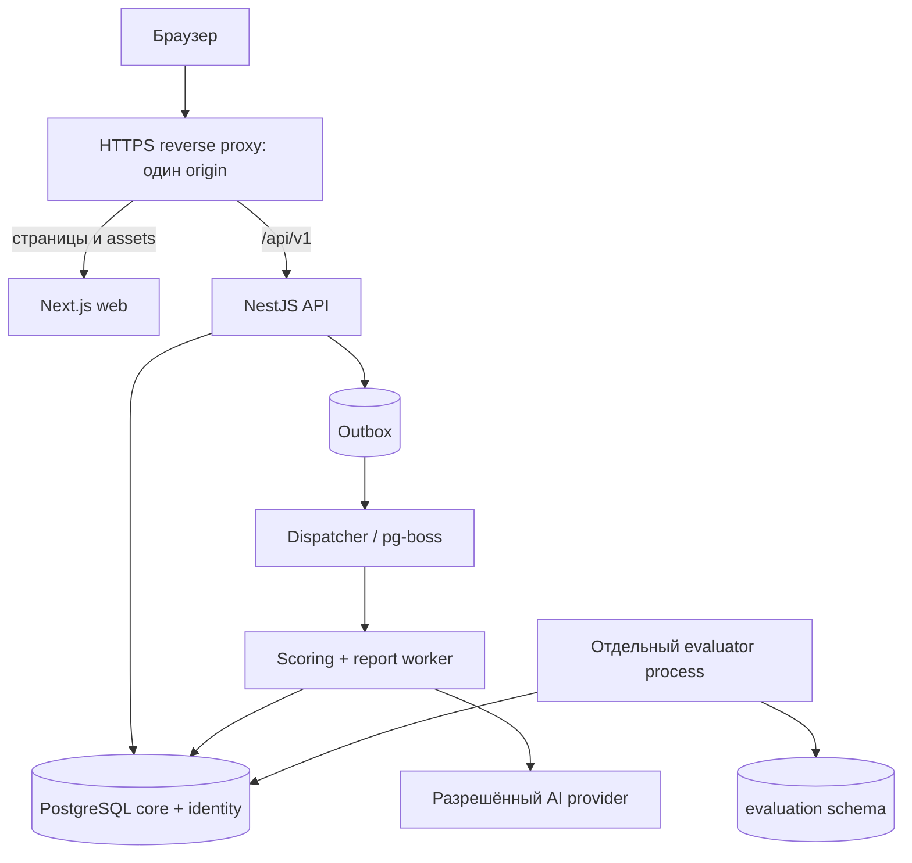

# 06. Архитектура и организация кода

## 06.1. Зафиксированный выбор

| Область | Решение |
|---|---|
| Frontend | React + Next.js App Router + TypeScript strict |
| Backend | Node.js 24 LTS, NestJS с Fastify adapter, TypeScript strict |
| База | PostgreSQL 18, поддерживаемый security patch |
| Доступ к БД | Prisma; SQL migrations для RLS/ограничений, которые ORM не выражает |
| Очередь | pg-boss на PostgreSQL + transactional outbox; без Redis |
| Пакеты | npm workspaces, один root package-lock.json, `npm ci` |
| UI | Tailwind CSS, Radix primitives/shadcn-style local components, Lucide icons |
| Формы | React Hook Form + Zod; серверная валидация обязательна |
| Client cache | TanStack Query для интерактивных клиентских данных; RSC для оболочки/первого чтения |
| Таблицы | TanStack Table; pagination и фильтрация сервером |
| Motion/toasts | Motion для дозированных переходов; Sonner или эквивалент с доступной live-region |
| Тесты | Vitest, React Testing Library, Playwright, реальный PostgreSQL в integration |
| Логи/наблюдаемость | Pino JSON redacted logs; OpenTelemetry если необходим для deploy, без контента ответов |
| Локальный запуск | Docker Compose PostgreSQL + web/api/worker или процессы npm поверх БД |

На 16.09.2026 официальные страницы указывают Node 24 LTS и PostgreSQL 18 как стабильную поддерживаемую ветку. Patch-версии и совместимость Next/React/Nest/Prisma/pg-boss проверить при старте реализации, записать в ADR и lockfile. Не копировать непроверенные номера из памяти. Next минимум Node 20.9 не означает, что уже EOL-ветку следует выбирать.

## 06.2. Топология



Frontend не подключается к PostgreSQL. Backend не дублируется в Next route handlers. Бизнес-логика не живёт в React server actions. Next допускает только тонкий transport proxy при необходимости dev-среды; предпочтителен reverse proxy с одним origin. RSC server fetch передаёт cookie только доверенному внутреннему API и запрещает персональное кеширование.

API, report worker и evaluator — разные процессы/credentials одного modular monolith repository. Это разделение доступа и нагрузки, не набор независимых микросервисов. Один deployment pipeline с отдельно запускаемыми services.

Evaluator обслуживает также узкие внутренние HTTP операции ввода/чтения исходов. Публичный API передаёт ему короткоживущий подписанный actor/tenant/study/purpose контекст по внутренней сети. Evaluator повторно проверяет capability и фазу, использует собственный DB user; signing key не доступен report worker. Evaluation credentials отсутствуют в web/API/scoring процессах. Внутренний сервис не имеет публичного ingress. Это не обещание защиты от компрометации всей инфраструктуры, а изоляция штатного конвейера прогноза.

## 06.3. Дерево

```text
apps/
  web/
    src/app/
      (public)/login/page.tsx
      (public)/activate/page.tsx
      (manager)/app/layout.tsx
      (manager)/app/employees/
        page.tsx
        _components/employee-table.tsx
        _components/employee-editor.tsx
        _hooks/use-employee-filters.ts
        _lib/employee-view-model.ts
        [employeeId]/page.tsx
        [employeeId]/_components/employee-header.tsx
      (manager)/app/assessments/...
      (manager)/app/reports/...
      (manager)/app/studies/...
      (admin)/admin/...
      (participant)/participant/...
      (public)/participate/page.tsx
    src/features/
      authentication/
      assessment-wizard/
      test-runner/
      report-reader/
      study-comparison/
    src/components/ui/       # button, field, dialog — только общий UI
    src/components/layout/   # три оболочки
    src/lib/api/             # transport, generated typed client, error map
    src/lib/query/
    src/styles/tokens.css
  api/
    src/main.ts
    src/modules/
      auth/
      organizations/
      employees/
      scenarios/
      methods/
      assignments/
      participation/
      scoring/
      reports/
      reviews/
      studies/
      knowledge/
      notifications/
      privacy/
      audit/
    src/platform/             # config, DB, guards, errors, tracing, queue
  worker/
    src/jobs/score-attempt.ts
    src/jobs/generate-report.ts
    src/jobs/expire-invitations.ts
    src/jobs/process-data-request.ts
    src/jobs/outbox-dispatch.ts
  evaluator/
    src/evaluate-study.ts
packages/
  contracts/                  # публичные Zod DTO, enums, OpenAPI schemas
  domain/                     # pure rules: переходы, policy, типы без секретов
  scoring/                    # server-only scorer implementations + fixtures
  ai/                         # server-only adapters, schemas, prompt versions
  database/                   # Prisma schema, SQL migrations, tenant transaction
  config/                     # tsconfig/eslint shared
  testing/                    # synthetic factories, fixtures
docs/
infra/
  compose.yaml
  docker/
scripts/
package.json
package-lock.json
.env.example
```

Это шаблон структуры, не требование создать пустой файл для каждой папки. `features` содержит только переиспользуемый между страницами бизнес-процесс. Одностраничный компонент остаётся в `_components`. Не импортировать детали одной страницы в другую. Повторение сначала подтверждать, потом выделять общее.

## 06.4. Backend module

```text
assignments/
  assignments.module.ts
  assignments.controller.ts
  assignments.service.ts
  assignments.repository.ts
  assignments.policy.ts
  assignments.mapper.ts
  dto/                       # server-specific DTO если нужен
  tests/
```

Controller: auth/context/parse/call/serialize. Service: use case/transaction/state transition. Repository: SQL/ORM только с scoped transaction. Policy: явная проверка разрешения. Mapper: публичный DTO, никогда `return prismaEntity` с лишними полями. Валидационные схемы HTTP — `packages/contracts`; внутренний документ scoring не попадает в клиентский bundle.

Не использовать универсальный Repository без tenant как удобный escape hatch. Не создавать «god service» на весь продукт. Межмодульная операция вызывает публичный service/facade, не чужой repository напрямую.

## 06.5. Изоляция tenant и кэш

- Все tenant-сущности содержат `organization_id`, включая дочерние ответы/отчёты/события.
- HTTP principal получает org из подтверждённого membership или participant session. Переданный orgId сам по себе не авторизация.
- Каждый запрос к tenant data исполняется в одной транзакции с `set_config('app.organization_id', value, true)`; `true` означает transaction-local. Не использовать session-level SET с pool.
- Runtime роли не владеют таблицами и не имеют BYPASSRLS. На tenant tables RLS + FORCE ROW LEVEL SECURITY; отсутствие context означает deny.
- DB RLS обеспечивает tenant-границу; row/role scope внутри tenant дополнительно проверяет policy. RLS не заменяет participant assignment guard.
- Логи и Query keys содержат tenant ID и scope. При смене организации/logout очистить client Query cache.
- Персональные HTTP ответы: `Cache-Control: private, no-store`. Next fetch для персональных данных `cache: 'no-store'`; нельзя static pre-render или shared cross-user cache.
- UUID не является контролем доступа; чужой ID возвращает generic 404.

## 06.6. Надёжные фоновые действия

1. Транзакция сохраняет submitted attempt и outbox event.
2. Dispatcher доставляет event в pg-boss. Повторная доставка допустима.
3. Worker загружает актуальный scoped объект и проверяет state/consent/data_generation.
4. Side effect дедуплицируется DB unique key `(job_type, input_hash, entity_id)` и compare-and-set.
5. Внешний AI вызывается вне длинной DB transaction.
6. Перед сохранением результата повторяется проверка generation/consent/cancelled.
7. Публикация и notification создаются атомарно с outbox.

Нельзя обещать exactly-once внешний AI вызов. Финальный бизнес-эффект идемпотентен, queue delivery рассматривается как at-least-once. Повтор после timeout может потратить второй запрос, но не публикует дубликат.

Для внешнего AI default: timeout 60s, 2 повтора с exponential backoff+jitter, общий deadline 5min; параметры конфигурируемы и не означают SLA. Permanent schema/safety errors не гонять бесконечно.

## 06.7. npm и команды реализации

В будущей root package.json обеспечить: `dev`, `build`, `lint`, `typecheck`, `test`, `test:integration`, `test:e2e`, `db:migrate`, `db:seed:demo`, `api:openapi`, `docs:build`, `docs:check`. Workspace scripts делегируются явно. Для одновременно запускаемых процессов допустим concurrently; Turborepo не обязателен.

Node pin — `.nvmrc` или `.node-version`; packageManager — точная npm версия. `npm ci` в CI, lockfile коммитится. Не создавать yarn/pnpm lock. `.env.example` содержит placeholders, реальные `.env*` кроме example исключены из git. Dev seed отказывается работать с production database.

## 06.8. Deployment

Docker images non-root, health/readiness отдельно, миграции единственным job до rollout. API и web за TLS одним origin; worker без публичного ingress. Отдельные runtime DB users. AI egress только к разрешённому provider. Production location и договорные условия утверждаются до реальных данных. Не выбирать зарубежный хостинг автоматически из-за удобства Next.js.
