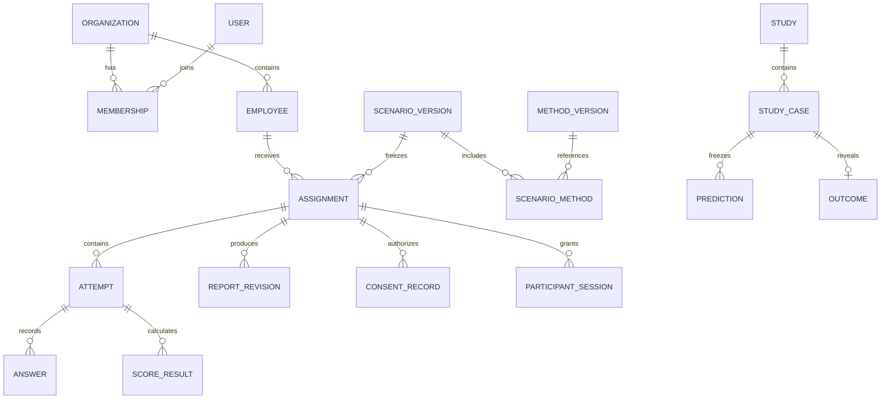

# 07. PostgreSQL: сущности и ограничения

## 07.1. Общие правила

UUID для внешних ID; timestamptz UTC; даты наблюдения отдельно от created_at; money как bigint minor units + ISO currency. Строковые коды enums с migration-политикой. `created_at`, `updated_at`, `revision` где есть редактирование. JSONB только для версионированных question/context/report schemas; membership/status/связи — нормализованы.

На каждой tenant-table: PK id + UNIQUE `(organization_id,id)`; дочерний FK `(organization_id,parent_id)` ссылается на такую пару. Это запрещает случайно связать ответ tenant A с назначением tenant B. Добавить индексы на FK и фактические фильтры.

Published version payload canonicalized + SHA-256 hash, immutable через application guard и DB trigger. Hash доказывает неизменность байтов, не истинность содержания.

## 07.2. ER-обзор

## 07.3. Таблицы идентичности и доступа

| Таблица | Основные поля / ограничения |
|---|---|
| `core.organizations` | id, name, code unique, timezone IANA, mode, status, participant_contact, active_employee_limit, retention_policy_version_id, readiness_state |
| `identity.users` | id, email_normalized unique, display_name, password_hash Argon2id, platform_role nullable, status, mfa_required; никаких employee answers |
| `core.memberships` | organization_id, user_id, role manager, permissions JSON allowlist, status; unique org/user; last owner protection |
| `identity.account_tokens` | id, user_id or invitation_id, purpose activation/reset, token_hash unique, expires_at, used_at, revoked_at; plaintext отсутствует |
| `identity.recovery_requests` | id, account_reference nullable, requested_at, state, verified_by, verified_at, resolution_ref; публичный ответ не раскрывает существование аккаунта |
| `identity.user_sessions` | id, session_hash unique, user_id, created_at, last_seen_at, idle_expires_at, absolute_expires_at, revoked_at; минимальные device hints |
| `identity.mfa_credentials` | user_id, encrypted_totp_secret, verified_at; recovery codes отдельные hashed rows |
| `core.access_grants` | org, grantee, purpose, resource_scope, permissions, requested_by, approved_by, expires_at, revoked_at, reason; проверка времени на каждом запросе |
| `identity.employees` | org, id, display_name nullable, external_code nullable, job_title, department, email nullable, archived_at; check name OR code; partial unique org/external_code |

Scoring/report runtime не имеет SELECT на identity.employees/users. Для вывода имени manager API собирает header отдельно от тела отчёта. AI payload использует случайный case code, роль и релевантный контекст, без имени/email.

## 07.4. Контент и методика

| Таблица | Поля |
|---|---|
| `core.methods` | id, stable_code unique, current_published_version_id nullable |
| `core.method_versions` | method_id, semantic_version, status, applicability_mode, passport_json, items_json, scoring_config_json, scorer_id/version, interpretation_rules_json, missing_policy, license_metadata, validation_metadata, content_hash, published_at/by; unique method/version |
| `core.scenarios` | id, stable_code, title |
| `core.scenario_versions` | scenario_id, version, status, mode, context_schema_json, reporting_policy_id/version, participant_visibility, prompt_version_id, hash |
| `core.scenario_methods` | scenario_version_id, method_version_id, order_index, required; unique scenario/order and scenario/method |
| `core.prompt_versions` | id, key, version, immutable template, output_schema_version, provider_policy_id, review metadata; system prompts server-only |
| `core.knowledge_articles` / `article_versions` | stable slug/locale, title, category, audience, markdown, excerpt, status, hash, published_at/by |
| `core.legal_document_versions` | key, locale, version, status draft/approved/retired, body, content_hash, effective_from, approver; applicable purpose |
| `core.retention_policy_versions` | scope/purpose, срок active/archive/backup, основания, mode, approval metadata; published immutable |

Глобальная библиотека не содержит данных сотрудников. Backend public method projection возвращает только тексты/варианты, никогда scoring_config/keys/norm tables.

## 07.5. Назначения и ответы

| Таблица | Поля / инварианты |
|---|---|
| `core.assignment_drafts` | org, creator, scenario_version, context_json, selected employee IDs, revision; draft cleanup policy |
| `core.assignments` | org, employee_id (composite FK identity), scenario_version_id, context_snapshot, mode, state, due_at, created_by, completed_at, cancelled_at, replaces_assignment_id, data_generation bigint default 1, processing_hold bool |
| `core.invitations` | org, assignment_id, token_hash, expires_at, revoked_at, issued_by, last_exchanged_at; одна активная invitation version на назначение; token только один раз в выдаче |
| `core.participant_sessions` | org, assignment_id, invitation_id, session_hash, lease_version, expires_at, revoked_at; scope не расширяется до employee history |
| `core.consent_records` | org, assignment_id, document_version_id, document_hash, purpose, accepted_at, withdrawn_at, confirmation_metadata; receipt immutable, withdrawal отдельное событие |
| `core.attempts` | org, assignment_id, method_version_id, state, started_at, submitted_at, question_order_json, active_item_id, revision, session_lease; unique assignment/method |
| `core.answers` | org, attempt_id, item_id, response_json, revision, saved_at; unique attempt/item; item принадлежит закреплённой версии |
| `core.submission_snapshots` | org, attempt_id unique, answers_snapshot_json, input_hash, consent_hash, submitted_at; immutable до удаления |
| `core.score_results` | org, attempt_id, scorer_version, input_hash, output_schema_version, result_json, missing_json, created_at; unique attempt/scorer/input |

Принятый submit фиксирует набор ответов атомарно. Пересчёт обновлённым алгоритмом создаёт новую score revision и явную связь, не меняет исторический результат. Права пересчёта реальных исследований определяются протоколом.

## 07.6. Отчёты и действия

| Таблица | Поля |
|---|---|
| `core.reports` | org, assignment_id, current_published_revision_id nullable, status |
| `core.report_revisions` | org, report_id, revision_no, state, input_hash, evidence_snapshot_hash, prompt/schema/model_version, generation_mode fake/template/llm, content_json, content_hash, reviewer_id nullable, published_at, supersedes_id; unique report/revision |
| `core.evidence_items` | org, assignment_id, stable evidence ID, kind self_report/work_fact/method_result/manager_opinion, source_id, collected_at, normalized_content, limitations, content_hash; permissioned viewer |
| `core.report_reviews` | org, revision_id, reviewer, checklist_json, action, comment, reviewed_at; immutable review log |
| `core.decisions` | org, report_revision_id, actor_id, action_code, user_comment, follow_up_at, created_at; не превращается в outcome автоматически |
| `core.correction_requests` | org, resource_id, requester_type/id, block_key, description, state, resolution_reference |
| `core.notifications` | org, recipient_user_id, type, resource_ref, read_at, event_key unique; без report body |

Опубликованный отчёт хранит ссылку на evidence snapshot. Удаление данных затрагивает и производные evidence/report, иначе исходный ответ фактически сохраняется в другом виде.

## 07.7. Исследования и отделённые исходы

| Таблица | Поля |
|---|---|
| `core.studies` | org, title, type, scenario_version_id, protocol_json/hash, phase, locked_at, predictions_frozen_at, roster_hash, custodian_id, evaluator_id |
| `core.study_cases` | org, study_id, case_code unique within study, assignment_id nullable, snapshot_id nullable, inclusion_state, exclusion_reason, evidence_cutoff_at, follow_up_end_at, eligibility_attestation |
| `core.historical_snapshots` | org, case_id, feature_schema_version, observed_at/source_created_at, imported_at, payload, hash, source_provenance; не содержат исход |
| `core.baseline_predictions` | org, case_id, value_json, entered_by, locked_at/hash; до просмотра системного прогноза |
| `core.predictions` | org, case_id, target, horizon, value_json, output_type, supported_capability, method/report_version, frozen_at, hash; immutable freeze |
| `evaluation.outcomes` | org, case_id, event_type, occurred_at, observation_end_at, status observed/censored/unknown, value_json, source_ref, entered_by, revision; доступ только outcome/evaluator credentials |
| `evaluation.evaluation_runs` | org, study_id, protocol_hash, predictions_hash, outcomes_version, metrics_json, exclusions_json, computed_at, evaluator_version |

Не выдавать main API/report worker `USAGE/SELECT` на evaluation schema и не помещать evaluation credentials в их окружение. Нужные manager исследовательские запросы делегируются узкому внутреннему evaluator/outcome процессу с собственным connection pool и повторной policy-проверкой. AI worker dependency graph не включает этот клиент и не имеет ключа внутренней авторизации.

## 07.8. Служебные таблицы

`outbox_events`: event ID, type, entity reference, org, generation, published_at, attempts. Payload только IDs и безопасные технические параметры.

`idempotency_records`: actor/scope/method/route/key unique, request_hash, response_reference, state, expires_at. Не сохранять plaintext invitation URL как replay body. Dedicated invitation issue endpoint возвращает secret только в первом успешном ответе; повтор с тем же ключом возвращает metadata и `secretAvailable=false`, а UI предлагает явный перевыпуск новой ссылки с новым key. Первое назначение не дублируется. Старый token отзывается только после явного rotate. Это правило применяется также к activation/reset URL.

`audit_events`: actor, purpose, tenant/resource, event, timestamp, request_id, allowlisted diff metadata. Запрет на raw responses/token/password/prompt.

`privacy_requests` + `deletion_jobs`: subject scope, purpose, state, holds, approval, data_generation fence, receipts. `readiness_checks`: org, key, state, verified_by, evidence_ref, expires_at.

## 07.9. Индексы и целостность

- assignments `(organization_id,state,due_at)`, `(organization_id,employee_id,created_at desc)`.
- reports `(organization_id,status,published_at desc)` через подходящую схему/denormalized field с транзакционным обновлением.
- employees `(organization_id,archived_at,id)`; trigram index только если поиск на реальном объёме требует его.
- ответы unique `(organization_id,attempt_id,item_id)`.
- invitations unique token_hash; partial unique active `(organization_id,assignment_id)`.
- published version update trigger; study phase transition guard; CHECK корректного диапазона дат; FKs RESTRICT там, где cascade может уничтожить доказательства без процедуры.
- Лимит активных сотрудников и последнего owner проверяется конкурентно, с row lock организации/transaction.

## 07.10. Миграции и демо

Миграция создаёт таблицы, роли, grants, RLS и индексы. Runtime не имеет CREATE/ALTER. Demo seed: две изолированные компании, роли, синтетические коды сотрудников, три сценария, три synthetic methods, разные состояния. Никаких опубликованных чужих тестов, действительных email/телефонов и данных с референсных скриншотов. Контрольные значения — для проверки алгоритма, не статистика качества людей.
