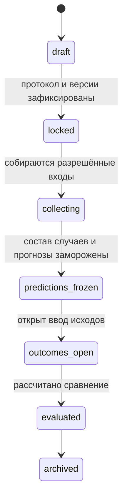

# 11. Ретроспективная проверка и слепой режим

## 11.1. Три разных режима исследования

| Режим | Вход | Что допустимо заключать |
|---|---|---|
| `historical_snapshot` | Данные, существовавшие до события, с provenance | Ретроспективная проверка метода на доступных тогда сведениях |
| `prospective` | Новое тестирование сейчас, исход наблюдается позже | Проспективная проверка при выполнении протокола |
| `retrospective_description` | Новые ответы о людях с уже известным прошлым | Описательное сопоставление; не доказательство предсказания |

Скрыть поле исхода недостаточно, если последствия события уже присутствуют в ответах. Платформа обязана показывать тип данных и не выдавать третий режим за первый.

Техническая цель «10 сотрудников прошли» проверяет процесс. Научное качество и готовность к коммерческому использованию — отдельные результаты. Три сценария не объединяются в один процент точности.

## 11.2. Протокол до результатов

Зафиксировать: задача/target, горизонт, единица наблюдения, критерии включения/исключения, источник входных сведений, cutoff, определение исхода, версии метода, baseline, схема прогноза, правило abstention, метрики, правила incomplete/censored cases, конфликт доступа, допустимость управленческого вмешательства.

Для ухода: различать voluntary exit, internal move, dismissal и ещё не завершившийся период. Для повышения: определить результат работы в целевой роли, а не факт назначения. Для обучения: не называть причинным эффектом простое улучшение после курса; в P0 допускается только описательное исследование без утверждения ROI.

Протокол может содержать `predictive_capability_unavailable`: система честно проверяет процесс, но кнопка расчёта predictive metrics недоступна. Не превращать recommendation text в бинарный прогноз после просмотра исходов.

## 11.3. Фазы

Freeze требует: все включённые случаи имеют прогноз или документированное abstention/exclusion; baseline сохранён до просмотра системного ответа; version IDs закреплены; hashes сформированы. Состав случаев замораживается вместе с прогнозами, чтобы нельзя было скрыть неудобные ошибки.

После lock исправление правил означает новый protocol version/новое исследование, а не тихую перезапись. При отзыве участия исключение фиксируется нейтрально; deleted data не сохранять ради красивой статистики.

## 11.4. Разделение доступа

- Outcome custodian вносит исходы только после predictions_frozen. Он может знать события раньше вне системы — это процедурное ограничение, которое код не устраняет.
- Report/scoring worker, автор prompt и рецензент данного исследования не получают labels через payload, joins, API, журналы и поддержку.
- Один actor не может одновременно рецензировать прогнозы и вводить исходы в рамках study. Смена permissions до freeze также учитывается историей ролей, не только текущим флагом.
- Известные исходы находятся в evaluation schema под отдельными credentials. Основной pipeline не имеет доступа.
- После freeze выводы нельзя редактировать. Исправление отображается отдельно и не подменяет исходный прогноз.
- До freeze UI скрывает не только labels, но и агрегированные результаты, counts by outcome и названия групп, раскрывающие их.

Называть режим «слепым для конвейера оценки», не утверждать двойное ослепление всех участников. Не гарантировать отсутствие косвенной утечки только на основании RLS.

## 11.5. Метрики

Показывать counts и знаменатели. Для binary event: TP, FP, FN, TN; recall, precision, specificity, balanced accuracy при определённых denominators. Если знаменатель0 — `Недостаточно наблюдений`, не0%. Plain accuracy можно показывать рядом с базовой частотой и baseline, но не единственным показателем.

Для вероятностей: только если модель вправе их выдавать; Brier score/calibration при достаточных данных, не красивый gauge на10 случаях. Порог зафиксирован до labels. Для continuous outcome — заранее определённая error metric; не смешивать шкалы разных методик. Для recommendations без предсказания — качество оснований/понятности, не predictive accuracy.

Малую выборку помечать описательной. Интервалы показывать только с названием метода и предпосылками. Кластеризация по компании/связанным случаям учитывается при следующем исследовательском дизайне; простой интервал для независимых наблюдений не выдавать за универсальный.

## 11.6. Вмешательства и follow-up

Отдельное поле management action после прогноза. Если условия изменили и человек остался, нельзя автоматически считать прогноз ухода ошибкой или доказанным удержанием. Отмечать вмешательство и ограничение интерпретации. Не называть отсутствие увольнения к середине горизонта окончательным исходом.

## 11.7. Технические fixtures и приёмка

Synthetic study10 cases: известные разработчику фиктивные outcomes, но pipeline использует отделённую schema. Это проверка механизма, не реальная точность. Expected confusion matrix рассчитывается заранее в тесте, экспорт воспроизводит значения.

Обязательные проверки: запрет исходов до freeze; отказ score credentials читать evaluation; невозможность повторного freeze с изменёнными входами; запрет редактирования prediction; zero denominators; censored case; missing outcome; отзыв случая; role conflict; отсутствие labels в AI payload; hash/версии на экспортированных данных.
